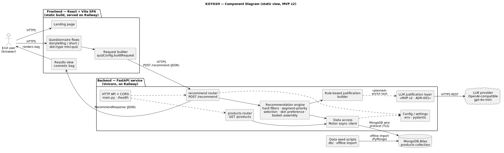

# KOYASH Architecture

This is the maintained architecture index for KOYASH. It documents the current
delivered system — the structures, components, and decisions needed to reason
about how the product works, how it is deployed, and how it can evolve.

KOYASH is a skincare recommendation service: a **React + Vite** single-page
frontend collects the user's budget, ethical preferences, allergens, skin
concerns, and skin type, and a **FastAPI** backend turns that into a structured
"cosmetic bag" of real products with a per-product justification. Product data
lives in **MongoDB Atlas**. In MVP v2 an **LLM justification layer**
(gpt-4o-mini, justification-only) is being added on top of the existing
rule-based engine.

This document is built up across the Sprint 3 architecture PBIs:

- **Static view** — component diagram + commentary (this PR, PBI-305) ✅
- **Dynamic view** — `/recommend` sequence diagram (PBI-306) — _in progress_
- **Deployment view** — Railway + MongoDB Atlas (PBI-307) — _in progress_
- **Architecture Decision Records (ADRs)** — at least three, linked to quality
  requirements (PBI-308) — _in progress_

Maintained architecture assets live under:

- [`static-view/`](static-view/) — static structure (component diagram)
- [`dynamic-view/`](dynamic-view/) — runtime behaviour (sequence diagrams)
- [`deployment-view/`](deployment-view/) — deployment / runtime topology
- `adr/` — Architecture Decision Records

Quality requirements referenced below are defined in
[`docs/quality-requirements.md`](../quality-requirements.md) and verified by the
tests in [`docs/quality-requirement-tests.md`](../quality-requirement-tests.md).

---

## Static View — Component Diagram

> Source: [`static-view/component-diagram.puml`](static-view/component-diagram.puml)
> (PlantUML). The SVG is the rendered form of that source; re-render after
> editing the `.puml`.

### What the diagram shows

The diagram captures the main internal components, the external systems they
talk to, and the protocols between them.

- **Frontend (React + Vite SPA, served on Railway).** The landing page and the
  three questionnaire flows (storytelling, short, and the new skin-type
  mini-quiz) collect the user's answers. A request builder
  (`quizConfig.buildRequest`) assembles them into the `/recommend` payload, and
  the results view renders the returned cosmetic bag. The frontend talks to the
  backend only over **HTTPS**, calling `POST /recommend` (and `GET /products`).
- **Backend (FastAPI on Uvicorn, on Railway).** `main.py` wires CORS and exposes
  `/health`. Two routers handle the API surface: `POST /recommend` and
  `GET /products`. The **recommendation engine** (`app/api/recommend.py`) applies
  the hard filters (vegan and cruelty-free as a MongoDB query; allergens
  case-insensitively in Python), then does segment-priority selection, skin-type
  preference, and basket assembly. The **rule-based justification builder**
  produces the per-product explanation today; in MVP v2 the **LLM justification
  layer** (ADR-001) enriches that text using gpt-4o-mini, with a fallback to the
  rule-based text. **Data access** is a thin Motor (async MongoDB) client, and
  **config** is centralized in pydantic settings read from the environment.
- **External systems.** **MongoDB Atlas** stores the `products` collection,
  reached over the MongoDB wire protocol (TLS) via Motor. The **LLM provider**
  (OpenAI-compatible endpoint, gpt-4o-mini) is reached over HTTPS REST. The
  **data seed scripts** in [`db/`](../../db/) populate Atlas offline from the
  source dataset and are not part of the request path.

### Coupling and cohesion

- **Frontend ↔ backend are loosely coupled** through a single, explicit HTTP
  JSON contract (`RecommendRequest` / `RecommendResponse` pydantic models). They
  share no code and deploy independently — the frontend only depends on the
  shape of the API response.
- **The recommendation engine is highly cohesive but concentrated.** One module
  (`recommend.py`) owns hard filtering, segment fallback, skin preference,
  basket assembly, and (today) justification. That makes the core logic easy to
  locate and test, but the module is large; the selection logic and the
  justification logic are already separate functions, which is the natural seam
  to split along as the LLM layer and budget work grow.
- **External dependencies are isolated behind accessors.** The engine reaches
  the database only through `get_database()` / Motor, and the allergen filter
  deliberately runs in application code rather than in the database query. The
  LLM layer is introduced as a separate component the justification step calls,
  not as a dependency baked into selection — so the deterministic engine stays
  decoupled from the LLM.
- **Configuration is centralized** in one pydantic `Settings` object sourced
  from environment variables, so runtime/secret configuration is not scattered
  across modules.

### Maintainability implications

- The clear HTTP contract gives a stable, testable boundary between the two
  deployables (supports **Testability**) and lets the frontend and backend
  evolve on independent release cadences.
- Keeping selection deterministic and the LLM strictly additive (ADR-001) means
  MVP v2 can add richer explanations without putting an external, variable-latency
  service on the critical selection path — protecting **modifiability** and
  performance headroom.
- The main maintainability risk is the size of `recommend.py`: as the LLM layer
  (PBI-303) and budget-precision work (PBI-302) land, splitting selection and
  justification into separate modules will keep each change local and reviewable.

### Quality requirements this structure supports or constrains

- **[QR-001 — Allergen-safe recommendations](../quality-requirements.md#qr-001-allergen-safe-recommendations)
  (Functional correctness).** The allergen exclusion lives in application code
  inside the engine, in one place, so it can be verified directly and
  continuously (QRT-001) rather than trusted to a database query.
- **[QR-002 — Robust recommendation across the input space](../quality-requirements.md#qr-002-robust-recommendation-across-the-valid-input-space)
  (Fault tolerance).** Segment-priority fallback and the empty-basket →
  structured `422 NO_PRODUCTS_AVAILABLE` path are both owned by the engine, so
  the system degrades gracefully instead of failing on sparse filter
  combinations.
- **[QR-003 — Recommendation response time](../quality-requirements.md#qr-003-recommendation-response-time)
  (Time behaviour).** The core path is a single MongoDB query plus in-process
  selection with no per-product external calls. The LLM layer is the main
  latency risk, which is exactly why ADR-001 keeps it off the selection path and
  optional.

---

## Dynamic View

_To be added in PBI-306: a sequence diagram of the `POST /recommend` flow
(questionnaire → request builder → API → engine → filters → segment fallback →
basket assembly → justification → response), with an explanation of the scenario
and the quality requirements it helps reason about._

## Deployment View

_To be added in PBI-307: the runtime topology — the React build and the FastAPI
service on Railway, MongoDB Atlas as the datastore, the external LLM provider,
and the customer-facing access path — with the rationale for the deployment
model._

## Architecture Decision Records (ADRs)

_To be added in PBI-308. Planned records, each linked to the quality
requirement(s) it addresses:_

- _**ADR-001** — Rule-based selection engine with the LLM as a justification-only
  layer (→ QR-001, QR-003)._
- _**ADR-002** — MongoDB Atlas as the product datastore (→ QR-002)._
- _**ADR-003** — Budget handled as discrete segments with nearest-segment
  fallback (→ QR-002)._
